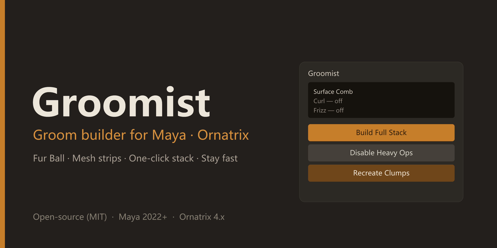
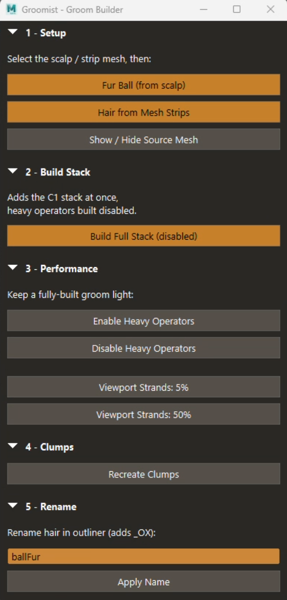
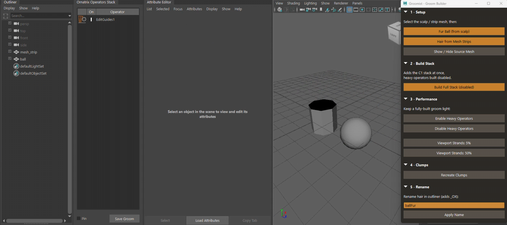

# Groomist — Groom Builder for Maya (Ornatrix)

A lightweight shelf tool that turns a repeatable, studio-style **Ornatrix
grooming pipeline** into one-click actions: build the distribution, stack the
operators in the right order, keep a heavy groom fast in the viewport, rebuild
clumps, and name the asset for handoff. Companion to Materialist.



## Why

Ornatrix is a fast look-dev tool, but the strongest stylized grooms come from
treating the groom as a *pipeline*, not a one-off. Groomist encodes one decision
order — **silhouette → regional control → render response → handoff safety** —
and lays the UI out top-to-bottom to enforce it. The operator order and steps
are generic Ornatrix-in-Maya; nothing here is specific to any one show or studio.

The headline idea: **build the whole operator stack at once, but create the
heavy operators disabled.** You get the full, art-directable stack immediately,
while the viewport stays light — then you switch detail on only when you need it.

## Features



### 1 · Setup
- **Fur Ball (from scalp)** — grows strands from a selected scalp mesh
  (`OxQuickHair`). Best for short fur, brows, and animal fur. New furballs are
  created at a low default guide length so they don't come out as a giant ball,
  and the auto-added RenderSettings node is removed (width is handled by the
  Change Width operator instead).
- **Hair from Mesh Strips** — builds strands off hair-tube geometry
  (`OxAddHairFromMeshStrips`) for long, graphic hair, and auto-adds the
  `GroundStrands` + `ChangeWidth` base.
- **Show / Hide Source Mesh** — toggles visibility of the original scalp/strip
  mesh the selected groom is built from. It hides the mesh *shape* (not its
  transform), so a furball's hair — which Ornatrix parents under the scalp —
  stays visible when you hide the scalp.

### 2 · Build Stack
One click adds the full operator stack in pipeline order, **with the heavy
operators created disabled** so the viewport stays responsive:

| # | Operator | Role | Built |
|---|----------|------|-------|
| 1 | Surface Comb | direction | enabled |
| 2 | Rotate | direction | enabled |
| 3 | Clump | shape | **disabled** |
| 4 | Curl | shape | **disabled** |
| 5 | Frizz | variation | **disabled** |
| 6 | Detail | variation | **disabled** |
| 7 | Noise | variation | **disabled** |
| 8 | Gravity | settle | enabled |
| 9 | Change Width | render tuning | enabled (low width) |

The light, silhouette-defining operators stay on (lock the big forms first); the
heavy ones go on in pass-through. The final **Change Width** is set to a low
default so strands render thin out of the box. Operators are added in evaluation
order, so the stack reads broad-flow-first, render-tuning-last.

### 3 · Performance
- **Enable / Disable Heavy Operators** — toggles Clump, Curl, Frizz, Detail and
  Noise on or off in one click, using `OxEnableOperator` so the Ornatrix
  stack-dialog checkboxes stay in sync.
- **Viewport Strands: 5% / 50%** — sets the generator's **View Percentage**.
  Hair-from-Guides uses a 0–1 fraction and Hair-from-Mesh-Strips a 0–100 value;
  Groomist applies the right scale for each. The cheapest global speedup,
  independent of which operators are on.

### 4 · Clumps
- **Recreate Clumps** — deletes and rebuilds every Clump operator's clumps from
  the current groom (the fix for clumps that go buggy after an upstream change).
  Mirrors the operator's *Delete* + *Create Clump(s)* buttons and leaves the
  Clump node selected afterwards.

### 5 · Rename
- **Apply Name** — renames the hair's outliner node to `<your name>_OX`, for a
  clean, rig-friendly asset name.

Each section's collapse state and the window geometry are remembered between
sessions, and the palette matches the companion Materialist tool.

## How the "build disabled, fast viewport" model works

Two independent speed levers Groomist exposes:

1. **Per-operator enable** — `OxEnableOperator <node> 0/1`, the same toggle as the
   Ornatrix stack-dialog checkbox. Build Stack uses it to create heavy operators
   disabled; Performance toggles them in bulk.
2. **View Percentage** — the generator's viewport strand fraction
   (`viewportCountFraction`, 0–1, on Hair-from-Guides; a 0–100 "View Percentage"
   on Hair-from-Mesh-Strips). Show 5% of strands while grooming, 50% for review.

Keep render counts high only at render time, and a fully-built groom stays light
while you work.

## Requirements & compatibility

| | Version |
|---|---|
| **Tested / confirmed** | Autodesk **Maya 2022** · Ornatrix for Maya **4.1.8** |
| **Expected to work** | Maya 2022+ (Python 3) · Ornatrix **4.x** |
| **Not verified** | Maya 2020 and earlier (Python 2 builds) · Ornatrix 2.x / 3.x |

Ornatrix node and command names can change between releases. Everything
version-specific is grouped in the **OX ADAPTER** block at the top of
`groomist.py` (the operator node types, and the `OxQuickHair`,
`OxAddHairFromMeshStrips`, `OxAddStrandOperator`, `OxEnableOperator` and
`OxEditClumps` calls), so adapting to another Ornatrix release is a one-place
edit. If a button errors on a different version, that block is where to look.

Look development (shaders/ramps) is intentionally out of scope; Groomist focuses
on building, grooming and handoff.

## Installation

1. Copy `groomist.py` into your Maya scripts folder:
   - Windows: `C:\Users\<you>\Documents\maya\scripts\`
   - macOS: `~/Library/Preferences/Autodesk/maya/scripts/`
   - Linux: `~/maya/scripts/`
2. Restart Maya, or refresh the Python script path.

## Usage

Run in the Script Editor (Python tab), or from a shelf button:

```python
import groomist
groomist.show()
```

A typical flow:

1. Select your scalp (or strip) mesh → **Fur Ball** / **Hair from Mesh Strips**.
2. **Build Full Stack (disabled)** — the whole stack appears; heavy ops are off.
3. Groom with a fast viewport; **Enable Heavy Operators** to review detail, or
   **Viewport Strands: Low** to stay responsive on dense grooms.
4. **Recreate Clumps** if clumps misbehave after edits.
5. **Apply Name** before handoff.

### Make a shelf button

1. Paste the two lines above into a **Python** tab of the Script Editor.
2. Select the text and middle-mouse-drag it onto a shelf (or use
   **File > Save Script to Shelf**).

## Demos

**Fur Ball** — one-click furball setup from a scalp mesh:



**Hair from Mesh Strips** — strands built off strip geometry:


## Configuration

A few constants at the top of `groomist.py`:

| Constant | Default | Meaning |
|----------|---------|---------|
| `CHANGE_WIDTH_DEFAULT` | `0.05` | Strand width set by Build Stack's Change Width |
| `FURBALL_LENGTH_DEFAULT` | `1.0` | Guide length applied to a new furball |
| `VIEWPORT_LOW` | `5` | View percentage for the "5%" button |
| `VIEWPORT_HIGH` | `50` | View percentage for the "50%" button |
| `STACK_ORDER` / `HEAVY_OPS` | — | Which operators are added, and which start disabled |

Tune `CHANGE_WIDTH_DEFAULT` and `FURBALL_LENGTH_DEFAULT` to your scene scale.

## Notes

- Ornatrix node and command names can differ between versions; everything
  version-specific is grouped in the **OX ADAPTER** block near the top of
  `groomist.py`, so adapting to another release is a one-place edit.

## License

MIT — see [LICENSE](LICENSE).

## Author

Ruxin Liang — [Behance](https://www.behance.net/ruxin-liang)
